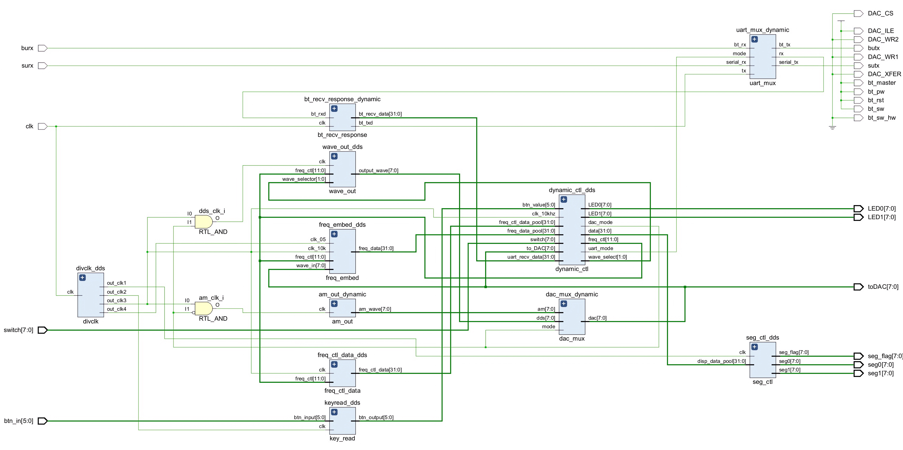

# dds_njust

南理工数字系统综合实验实验代码

开发版参考文档：https://e-elements.readthedocs.io/zh/ego1_v2.2/EGo1.html

## RTL图

## 功能

* AM调制（固定频率）
* 数码管动态显示
* 按键控制更改显示数字（带按键消抖）
* 四种波形的产生（正弦波/方波/三角波/锯齿波）
* 可更改频率控制字
* 带测频模块
* UART传输/发送（蓝牙/USB均可）

## 使用指南

### 按键/开关用途：

RESET（S5）：用于模式切换（AM/数字显示/DDS）

S0 ～ S4：上下按键用于更改数值，左右按键改变调节位，中间按键用于波形切换/信号输入切换

左侧拨码开关：用于进入频率控制字更改状态

右侧拨码开关：未分配

### AM调制模式

* 数码管前四位用四个A填充，后四位显示当前波形频率（0569）
* DAC输出AM调制波形

### 数显模式

* 通过S0 ～ S4的上下按键更改当前指定位的数值，左右按键更改指定位，数码管下的LED灯会表明指定位
* 当串口有数据传入时会暂时显示传入的字符串（8位数字，移位显示），按下按键会切换为学号显示
* 通过S0 ～ S4的中间按键更改串口输入数据的来源
* 右侧LED指示了串口数据的来源，左半侧亮灯表明当前接收USB输入，右半侧亮灯表明当前接收蓝牙输入
* 开发版蓝牙ID: MLT-BT05

### DDS模式

* 通过S0 ～ S4的中间按键更改输出波形，右侧LED会指示当前显示的波形类型
* 左侧的LED连接了波形信号，在波形输出频率较低时可以看到不同波形的区别
* 拨动任意一个左侧拨码，进入频率控制字更改模式，更改方式和数显模式类似，这里不再赘述
